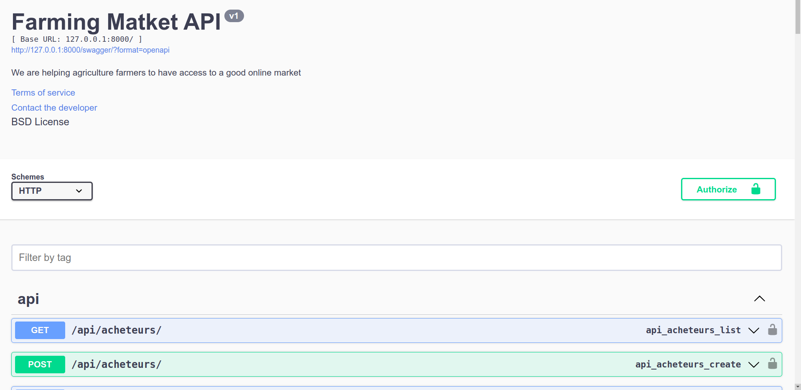

# Agricultural Marketplace API

The **Agricultural Marketplace API** is a robust and scalable backend solution designed to facilitate the management of an online agricultural marketplace. This API enables farmers, buyers, and other stakeholders to interact seamlessly by providing features such as user management, product listing, order processing, payment handling, messaging, and review systems. Built with modern web development tools, this API ensures efficiency, security, and ease of use.

---

## Role of the Application

The primary role of this application is to serve as the backbone of an agricultural marketplace platform. It allows:

- **Farmers** to list their products and manage orders.
- **Buyers** to browse products, place orders, and make payments.
- **Users** to communicate via messaging and leave reviews.
- **Admins** to manage users, products, orders, and payments.

By centralizing these functionalities, the API streamlines operations, enhances user experience, and promotes transparency in agricultural transactions.

---

## Key Benefits

1. **Efficient User Management**: Easily manage farmers, buyers, and other users with dedicated endpoints.
2. **Product Listing**: Farmers can list their products with details such as name, description, price, and images.
3. **Order Management**: Buyers can place orders, and farmers can manage them efficiently.
4. **Payment Integration**: Secure payment handling ensures smooth transactions.
5. **Communication**: Built-in messaging allows users to communicate directly.
6. **Review System**: Users can leave reviews, fostering trust and accountability.
7. **Scalable and Secure**: Built with Django and Django REST Framework, the API is scalable and secure.

---

## Tools and Technologies Used

The application leverages the following tools and libraries:

- **Django**: A high-level Python web framework for rapid development and clean design.
- **Django REST Framework (DRF)**: A powerful toolkit for building Web APIs in Django.
- **Djoser**: For authentication and user management, providing endpoints for user registration, login, and password reset.
- **Pillow**: For handling image uploads and management, especially for product images.
- **drf-yasg**: For generating interactive API documentation using Swagger and ReDoc.
- **Swagger UI**: Integrated for easy API exploration and testing.

---

## API Documentation with Swagger

The API documentation is automatically generated using **drf-yasg** and is accessible via Swagger UI. This interactive documentation allows developers to explore the API endpoints, test requests, and understand the request/response structure.

### Swagger Page Preview

  
  
*Insert the Swagger UI screenshot here to showcase the interactive documentation.*

To access the Swagger UI, run the development server and navigate to `/swagger/` or `/redoc/` in your browser.

---

## Installation and Setup

1. **Clone the Repository**:
   ```bash
   git clone https://github.com/yourusername/agricultural-marketplace-api.git
   cd agricultural-marketplace-api